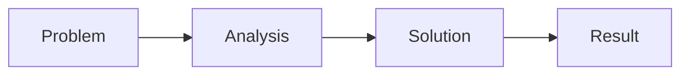

# Slidev Presentation Skill

Create markdown-based slide presentations using [Slidev](https://sli.dev). Supports building talks from scratch and converting existing blog posts into presentation format.

## When to Use This Skill

- User asks to create a presentation, talk, or slide deck
- User wants to convert a blog post into slides
- User mentions "make slides", "build a deck", "set up Slidev", or "presentation"
- User asks for a lightning talk, conference talk, or technical demo

## Presentation Types

| Type | Slides | Template | Best For |
|------|--------|----------|----------|
| Conference talk | 20-40 | `talk-from-scratch.md` | Full-length presentations |
| Blog conversion | 10-25 | `blog-post-conversion.md` | Turning articles into talks |
| Technical demo | 10-20 | `technical-demo.md` | Code-heavy walkthroughs |
| Lightning talk | 7-10 | `lightning-talk.md` | 5-minute rapid talks |

## Quick Slidev Syntax Reference

### Slide Separators and Structure

Slides are separated by `---` with blank lines above and below:

```markdown
---
theme: default
title: My Presentation
---

# Slide 1

Content here

---

# Slide 2

More content
```

The first `---` block is the **headmatter** (presentation-level config). Subsequent `---` blocks are **per-slide frontmatter**.

### Per-Slide Frontmatter

```markdown
---
layout: center
class: text-center
background: /images/bg.png
transition: slide-left
---
```

### Speaker Notes

Use HTML comments at the end of each slide:

```markdown
# My Slide

Content here

<!--
These are speaker notes visible in presenter mode.
Supports **markdown** formatting.
-->
```

### Essential Layouts

| Layout | Purpose | Slots |
|--------|---------|-------|
| `cover` | Title slide | — |
| `center` | Centered content | — |
| `default` | Standard content | — |
| `section` | Section divider | — |
| `two-cols` | Side-by-side | `::right::` |
| `two-cols-header` | Header + two columns | `::left::`, `::right::` |
| `image-right` | Content left, image right | `image` prop |
| `image-left` | Image left, content right | `image` prop |
| `quote` | Prominent quotation | — |
| `fact` | Large data/fact display | — |
| `statement` | Bold assertion | — |
| `end` | Final slide | — |

**Two-column example:**

```markdown
---
layout: two-cols
---

# Left Column

Content on the left

::right::

# Right Column

Content on the right
```

**Image layout example:**

```markdown
---
layout: image-right
image: /images/diagram.png
---

# Explanation

Text alongside the image
```

### Click Animations

**Basic v-click** (elements appear on click):

```markdown
<v-click>

This appears on first click

</v-click>

<v-click>

This appears on second click

</v-click>
```

**v-clicks on lists** (each item appears on click):

```markdown
<v-clicks>

- First point
- Second point
- Third point

</v-clicks>
```

**Directive form:**

```html
<div v-click>Appears on click</div>
<div v-click.hide>Disappears on click</div>
```

### Code Blocks

**Syntax highlighting with line highlights:**

````markdown
```ts {2,3}
function greet(name: string) {
  const message = `Hello, ${name}!`  // highlighted
  console.log(message)               // highlighted
}
```
````

**Click-stepped line highlighting:**

````markdown
```ts {1|2-3|5}
const a = 1        // click 1
const b = 2        // click 2
const c = a + b    // click 2
// gap
console.log(c)     // click 3
```
````

**Shiki Magic Move** (animated code transitions):

`````markdown
````md magic-move
```js
const greeting = 'hello'
```
```js
const greeting = 'hello'
const audience = 'world'
```
```js
const greeting = 'hello'
const audience = 'world'
console.log(`${greeting}, ${audience}!`)
```
````
`````

### Mermaid Diagrams

````markdown

````

### UnoCSS Styling

```markdown
<div class="text-3xl font-bold text-blue-500 mt-4">
  Styled text
</div>
```

Common utilities: `text-center`, `grid grid-cols-2 gap-4`, `mt-8`, `opacity-50`, `bg-gray-100`, `rounded-lg`, `p-4`.

### Images

```markdown

```

Or with styling:

```html

```

Images in the `public/` directory are served at the root path `/`.

## Procedure: Create Presentation from Scratch

### Step 1: Gather Requirements

Ask the user for:

1. **Topic and title** of the talk
2. **Audience** — who are they and what do they know?
3. **Duration** — determines slide count (roughly 1-2 minutes per slide)
4. **Type** — conference talk, demo, lightning talk?
5. **Key takeaways** — what should the audience remember?

### Step 2: Design the Outline

Create a structured outline with:

- Opening hook (1-2 slides)
- 3-5 main sections with clear transitions
- Supporting evidence per section (examples, code, diagrams)
- Closing with call to action

### Step 3: Read Baseline Configs

Read `baselines/headmatter.yaml` for presentation-level configuration reference.

### Step 4: Choose and Read Template

Select the appropriate template from `templates/` and use it as the skeleton.

### Step 5: Write the Slides

Apply these principles:

- **One concept per slide** — never overload
- **Minimal text** — 5-7 bullet points maximum, prefer fewer
- **Progressive disclosure** — use v-clicks to reveal points sequentially
- **Code readability** — max 15 lines per code block, highlight the important lines
- **Diagrams** — use Mermaid for architecture and flow, keep under 8 nodes

### Step 6: Add Speaker Notes

Every slide should have speaker notes with:

- What to say (key talking points)
- Timing guidance for longer talks
- Transition phrases to the next slide

### Step 7: Verify

- Run through the slide sequence mentally — does it flow?
- Check that each slide has a clear purpose
- Verify code examples are correct and highlighted appropriately
- Ensure consistent formatting throughout

### Step 8: Write Output

Create the presentation directory and files:

```
presentations/<talk-slug>/
├── slides.md          # The presentation
├── public/            # Images and static assets
│   └── images/
├── components/        # Custom Vue components (if needed)
└── snippets/          # External code files (if needed)
```

## Procedure: Convert Blog Post to Slides

### Step 1: Analyze the Post

Read the blog post and identify:

1. **Title** — becomes cover slide
2. **Opening anecdote** — becomes 1-2 hook slides
3. **H2 sections** — each becomes a section with 2-4 content slides
4. **Key quotes/rhetorical questions** — become quote/statement slides
5. **Code blocks** — become code slides (possibly with Magic Move)
6. **Lists** — become v-click progressive reveals
7. **Closing** — becomes call-to-action slide

### Step 2: Map Post Structure to Slides

Create a mapping table:

| Post Section | Slide(s) | Layout | Notes |
|-------------|----------|--------|-------|
| Title + intro | 1 (cover) | cover | Use post title, add subtitle |
| Opening story | 2-3 | default | Distill to key moments |
| H2: Section Name | 4 (section) | section | Section divider |
| Paragraph content | 5-7 | default/two-cols | One idea per slide |
| ... | ... | ... | ... |

### Step 3: Apply Distillation Rules

Blog content must be dramatically condensed for slides:

- **Paragraphs** → 2-4 bullet points capturing the essence
- **Long quotes** → Extract the punchline sentence only
- **Multi-step explanations** → Numbered list with v-clicks
- **Rhetorical questions** → Full-screen statement slides
- **Analogies** → Visual or two-column comparison slides
- **Code blocks** → Keep, but trim to essential lines (max 15)

### Step 4: Read Template

Read `templates/blog-post-conversion.md` for the skeleton structure.

### Step 5: Write Slides with Speaker Notes

The speaker notes should contain the deeper context from the original post that didn't make it onto the slides. This preserves the content for the speaker.

### Step 6: Enhance with Slidev Features

After the basic conversion:

- Add v-clicks to all lists
- Add line highlighting to code blocks
- Consider Magic Move for code that evolves
- Add Mermaid diagrams for processes described in prose
- Use image layouts where the post had images

## Slide Design Principles

1. **One concept per slide** — if you need "and" in the title, split it
2. **Minimal text** — slides are visual aids, not documents
3. **Progressive disclosure** — reveal complexity gradually with v-clicks
4. **Code readability** — large font, max 15 lines, highlight what matters
5. **Diagram simplicity** — max 8 nodes in a Mermaid diagram
6. **Consistent rhythm** — alternate between text, visual, and code slides
7. **Speaker notes carry depth** — put the nuance in notes, not on slides

## Output File Structure

All presentations live in the blog-content repository:

```
presentations/
└── talk-slug/
    ├── slides.md            # Main presentation file
    ├── public/              # Static assets
    │   └── images/          # Presentation images
    ├── components/          # Custom Vue components (optional)
    └── snippets/            # External code snippets (optional)
```

To run a presentation locally:

```bash
cd presentations/talk-slug
npx slidev slides.md
```

To export:

```bash
cd presentations/talk-slug
npx slidev export slides.md              # PDF
npx slidev export slides.md --format png  # PNG per slide
npx slidev export slides.md --format pptx # PowerPoint
```

## Supporting Files

| File | When to Read |
|------|-------------|
| `baselines/headmatter.yaml` | Starting any new presentation — full config reference |
| `baselines/slide-frontmatter.yaml` | Need per-slide options beyond layout/class |
| `references/layouts.md` | Need details on a specific layout or named slots |
| `references/syntax.md` | MDC syntax, external imports, scoped styles, variables |
| `references/animations.md` | Complex click sequences, v-motion, transitions |
| `references/code-features.md` | Magic Move, Monaco editor, code snippets, runners |
| `references/diagrams-and-math.md` | Mermaid config, PlantUML, KaTeX math |
| `references/components.md` | Built-in components (Arrow, Toc, Tweet, etc.) |
| `references/styling.md` | UnoCSS, dark mode, fonts, theme variables |
| `references/export-and-deploy.md` | PDF/PPTX/PNG export, SPA deployment |
| `templates/talk-from-scratch.md` | Building a conference talk |
| `templates/blog-post-conversion.md` | Converting a blog post to slides |
| `templates/technical-demo.md` | Code-heavy demonstrations |
| `templates/lightning-talk.md` | Short 5-minute talks |
| `examples/blog-conversion-walkthrough.md` | Seeing a full conversion example |

## Minimal Working Example

A complete 5-slide presentation:

```markdown
---
theme: default
title: Why Tests Matter
author: Stacey Vetzal
transition: slide-left
---

# Why Tests Matter

A short talk on the value of automated testing

<!--
Welcome everyone. Today I want to share why I think testing is one of the
most important practices we can adopt as developers.
-->

---
layout: section
---

# The Problem

---

## We Ship Bugs

<v-clicks>

- Manual testing misses edge cases
- "It works on my machine" is not a deployment strategy
- Regression bugs erode user trust

</v-clicks>

<!--
We've all been there. You ship something, it passes QA, and then a customer
finds a bug in an edge case nobody thought to check.
-->

---
layout: quote
---

# "The first rule of testing is that untested code is broken code."

<!--
This mindset shift is what changed everything for me. If you assume untested
code is broken, you start writing tests before you write the code.
-->

---
layout: end
---

# Thank You

Start testing today.
```

## Troubleshooting

- **Slides not rendering**: Ensure `---` separators have blank lines above and below
- **Layout not applying**: Check that `layout:` is in the slide's frontmatter block, not the content
- **v-clicks not working**: Ensure blank lines around `<v-clicks>` component and list items
- **Code highlighting wrong**: Use `{1,3-5}` syntax after the language identifier
- **Magic Move breaks**: Each code block inside must have the same language, use exactly 4 backticks for the outer fence
- **Images not showing**: Place files in `public/` directory, reference with `/` prefix (e.g., `/images/photo.png`)
- **Mermaid not rendering**: Check for syntax errors, keep diagrams simple (under 8 nodes)
- **Speaker notes not visible**: Use `<!-- comment -->` syntax at the end of each slide, press `p` in dev mode for presenter view
