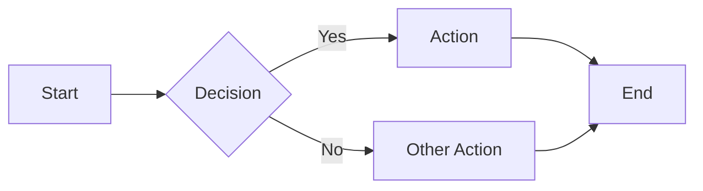
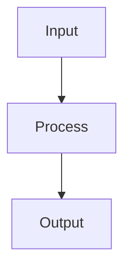
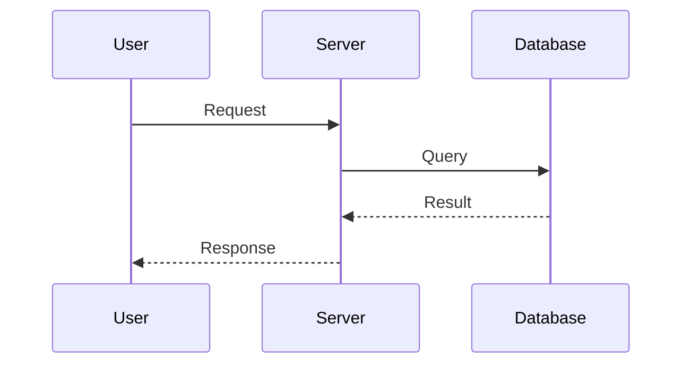
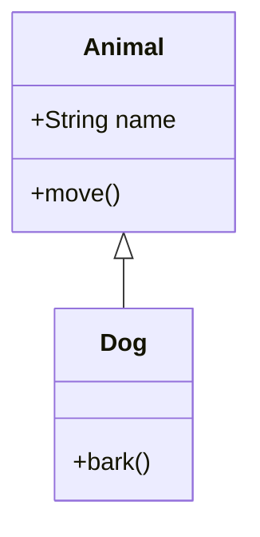
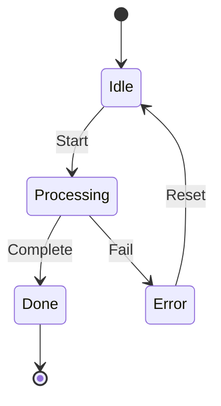
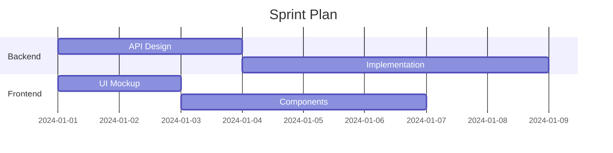
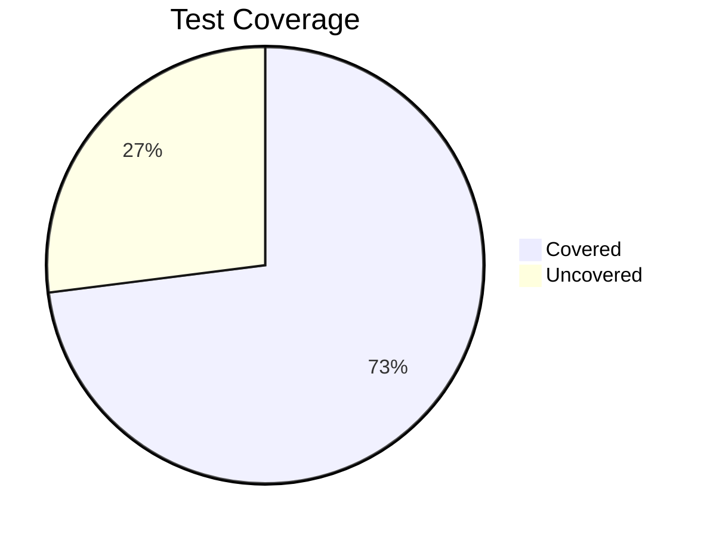
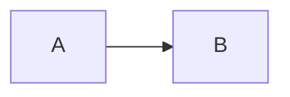
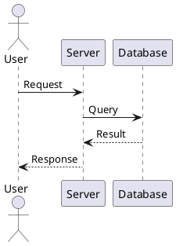

# Slidev Diagrams and Math Reference

Mermaid diagrams, PlantUML, and KaTeX math rendering.

## Mermaid Diagrams

Supported natively. Use fenced code blocks with `mermaid` language:

````markdown

````

### Common Diagram Types

**Flowchart:**

````markdown

````

Direction: `TD` (top-down), `LR` (left-right), `BT` (bottom-top), `RL` (right-left).

**Sequence Diagram:**

````markdown

````

**Class Diagram:**

````markdown

````

**State Diagram:**

````markdown

````

**Gantt Chart:**

````markdown

````

**Pie Chart:**

````markdown

````

### Mermaid Configuration

Set theme and scale via frontmatter directive within the code block:

````markdown

````

Themes: `default`, `neutral`, `dark`, `forest`, `base`.

### Tips for Slides

- Keep diagrams under 8 nodes for readability
- Use `LR` (left-right) for process flows on wide slides
- Use `TD` (top-down) for hierarchies
- Abbreviate labels — full descriptions go in speaker notes
- Consider using v-click with multiple diagram versions for progressive reveal

## PlantUML

Requires the `@slidev/plugin-plantuml` addon. Less commonly used than Mermaid.

````markdown

````

## KaTeX Math

Renders LaTeX math expressions. Enabled by default.

### Inline Math

```markdown
The formula $E = mc^2$ is famous.

When $n$ approaches infinity, $\sum_{i=1}^{n} \frac{1}{i}$ diverges.
```

### Block Math

```markdown
$$
\int_0^\infty e^{-x^2} dx = \frac{\sqrt{\pi}}{2}
$$
```

### Common Patterns

**Fractions:**

```markdown
$$\frac{a}{b}$$
```

**Subscripts/Superscripts:**

```markdown
$$x_i^2 + y_i^2 = r^2$$
```

**Matrices:**

```markdown
$$
\begin{bmatrix}
a & b \\
c & d
\end{bmatrix}
$$
```

**Summations:**

```markdown
$$\sum_{i=1}^{n} x_i = x_1 + x_2 + \cdots + x_n$$
```

### Chemical Equations (mhchem)

Using the mhchem extension:

```markdown
$$\ce{H2O -> H2 + 1/2 O2}$$
$$\ce{CO2 + H2O -> H2CO3}$$
```

### Tips for Slides

- Use inline math `$...$` for formulas within text
- Use block math `$$...$$` for standalone equations
- Keep equations simple on slides — put derivations in speaker notes
- Large matrices are hard to read on slides; consider splitting across slides
