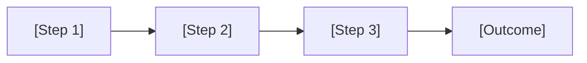

# Template: Conference Talk (20-40 slides)

Use this template for full-length presentations built from scratch.
Replace all `[PLACEHOLDER]` values and instructional comments.

---

```markdown
---
theme: default
title: "[TALK TITLE]"
author: "Stacey Vetzal"
info: |
  [One-line description of the talk].
  Presented at [event name].
transition: slide-left
colorSchema: auto
fonts:
  sans: Inter
  mono: Fira Code
---

# [TALK TITLE]

[Subtitle or tagline]

<div class="absolute bottom-10 left-12 text-sm opacity-60">
Stacey Vetzal — [Event Name] — [Date]
</div>

<!--
Opening: Set the tone. Welcome the audience. State the central question.
Target time: ~1 minute.
-->

---
layout: center
---

# [HOOK QUESTION OR STATEMENT]

<!--
A provocative question or bold statement that frames the entire talk.
Pause for effect before advancing.
-->

---

## [OPENING ANECDOTE TITLE]

[Brief anecdote or scenario that grounds the abstract topic in lived experience.
2-3 sentences maximum on the slide.]

<!--
Tell the full story here in your notes. This is the human moment that makes
the audience lean in. Spend 1-2 minutes on this.
-->

---
layout: section
---

# Part 1: [SECTION TITLE]

<!--
Transition phrase: "So let's start by looking at..."
-->

---

## [KEY POINT 1]

<v-clicks>

- [Observation or claim]
- [Supporting evidence]
- [Implication or "so what?"]

</v-clicks>

<!--
Expand each bullet in your own words.
Aim for ~30 seconds per bullet.
-->

---

## [KEY POINT 2]

<v-clicks>

- [Observation or claim]
- [Supporting evidence]
- [Implication]

</v-clicks>

<!--
Notes for this point...
-->

---
layout: two-cols
---

## [COMPARISON TITLE]

<v-clicks>

- [Left side point 1]
- [Left side point 2]
- [Left side point 3]

</v-clicks>

::right::

## [VS / ALTERNATIVE]

<v-clicks>

- [Right side point 1]
- [Right side point 2]
- [Right side point 3]

</v-clicks>

<!--
Use this for before/after, old/new, or comparing two approaches.
-->

---

## [CODE EXAMPLE TITLE]

<!-- Replace with relevant code -->

```ts {1|3-5|7}
// [DESCRIPTION: What this code demonstrates]
const example = 'before'

function transform(input: string) {
  return input.toUpperCase()
}

console.log(transform(example))
```

<!--
Walk through the code line by line using the click-stepped highlights.
-->

---
layout: section
---

# Part 2: [SECTION TITLE]

<!--
Transition: "Now that we've seen [Part 1 topic], let's look at..."
-->

---

## [KEY INSIGHT]

<v-clicks>

- [Point]
- [Point]
- [Point]
- [Point]

</v-clicks>

<!--
The core insight of this section. This is the "aha" moment.
-->

---

## [PROCESS OR ARCHITECTURE]



<!--
Walk through the diagram left to right. Explain each step.
Keep it to 4-6 nodes for readability.
-->

---

## [MICRO-STORY TITLE]

[A short anecdote or example from real experience — 2-3 sentences on slide.]

<!--
The full story with context. This breaks up the analytical content
with a human moment. ~1 minute.
-->

---
layout: section
---

# Part 3: [SECTION TITLE]

<!--
Transition: "So where does this leave us?"
-->

---

## [PRACTICAL ADVICE]

<v-clicks>

1. [Actionable step 1]
2. [Actionable step 2]
3. [Actionable step 3]

</v-clicks>

<!--
These should be things the audience can do tomorrow.
Be specific and concrete.
-->

---
layout: image-right
image: /images/[RELEVANT-IMAGE].png
---

## [VISUAL EXAMPLE]

[Brief description of what the image shows]

<v-clicks>

- [Observation about the image]
- [Why it matters]

</v-clicks>

<!--
If using an image, put it in public/images/ and reference from root.
-->

---
layout: quote
---

# "[MEMORABLE QUOTE]"

— [Attribution]

<!--
Choose a quote that encapsulates the talk's message.
Pause and let it land.
-->

---
layout: section
---

# Wrapping Up

---

## Key Takeaways

<v-clicks>

1. **[Takeaway 1]** — [One-sentence summary]
2. **[Takeaway 2]** — [One-sentence summary]
3. **[Takeaway 3]** — [One-sentence summary]

</v-clicks>

<!--
Recap the three things you want people to remember.
These should map to your three sections.
-->

---
layout: statement
---

# [CLOSING STATEMENT OR CALL TO ACTION]

<!--
End strong. This is your final thought — make it memorable.
Examples: "Start with empathy." / "The code is for humans." / "Ask better questions."
-->

---
layout: end
---

# Thank You

[Your contact info or social handles]

<!--
Smile. Breathe. Open for questions.
-->
```
