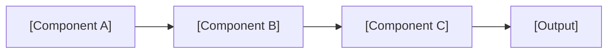
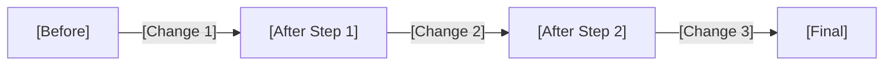

# Template: Technical Demo (10-20 slides)

Use this template for code-heavy presentations: refactoring walkthroughs,
library demos, architecture deep-dives.

---

```markdown
---
theme: default
title: "[DEMO TITLE]"
author: "Stacey Vetzal"
info: |
  [What this demo covers and why it matters.]
transition: slide-left
monaco: true
lineNumbers: true
---

# [DEMO TITLE]

[One-line description of what we're building/refactoring/exploring]

<div class="absolute bottom-10 left-12 text-sm opacity-60">
Stacey Vetzal — [Event/Context]
</div>

<!--
Set context: What are we looking at? Why does it matter?
~30 seconds, then dive in.
-->

---
layout: center
---

# The Problem

[One sentence describing the pain point]

<!--
State the problem clearly. Why does the audience care?
-->

---

## What We're Working With



<!--
Architecture overview. Keep it simple — just enough context
for the audience to follow the code.
-->

---

## The Starting Point

```ts {*}
// [FILENAME.ts] — Before refactoring
[Starting code — the "before" state]
[Keep under 15 lines]
[Show the problem clearly]
```

<!--
Explain what this code does and why it's problematic.
Point out the specific lines that need to change.
-->

---

## Step 1: [FIRST CHANGE]

<!-- Shiki Magic Move: code evolves through clicks -->

`````markdown
````md magic-move {lines:true}
```ts
// Before
[Original code]
```
```ts
// After step 1
[Code with first change applied]
```
````
`````

<!--
Walk through exactly what changed and why.
The Magic Move animation shows the diff visually.
-->

---

## Step 2: [SECOND CHANGE]

`````markdown
````md magic-move {lines:true}
```ts
// After step 1
[Previous state]
```
```ts
// After step 2
[Code with second change]
```
````
`````

<!--
Continue the evolution. Each step should be one clear change.
-->

---

## Step 3: [THIRD CHANGE]

`````markdown
````md magic-move {lines:true}
```ts
// After step 2
[Previous state]
```
```ts
// Final form
[Complete refactored code]
```
````
`````

<!--
Final transformation. Highlight how far we've come.
-->

---
layout: two-cols
---

## Before

```ts
[Original code — compact]
```

::right::

## After

```ts
[Final code — compact]
```

<!--
Side-by-side comparison. This is the "wow" moment.
Let the audience see the full transformation.
-->

---

## Live Editor

<!-- Interactive Monaco editor for audience experimentation -->

```ts {monaco}
// Try it yourself
[Editable code that the audience can modify]
[Include a clear example they can experiment with]
```

<!--
If presenting live, let people play with the code.
Have a fallback plan if Monaco doesn't load.
-->

---

## Running the Code

```ts {monaco-run}
// Click "Run" to execute
[Runnable code example]
console.log('[Expected output]')
```

<!--
Show the code running live. Demonstrates that the refactoring works.
-->

---

## What Changed



<!--
Visual summary of the transformation pipeline.
-->

---

## Test Results

```bash
$ npm test

  ✓ [test description 1] (2ms)
  ✓ [test description 2] (1ms)
  ✓ [test description 3] (3ms)

  Tests: 3 passed, 3 total
  Time:  0.5s
```

<!--
Show that everything passes. Tests are proof the refactoring works.
-->

---
layout: section
---

# Key Takeaways

---

## What We Learned

<v-clicks>

1. **[Principle 1]** — [One-line explanation]
2. **[Principle 2]** — [One-line explanation]
3. **[Principle 3]** — [One-line explanation]

</v-clicks>

<!--
Extract the general lessons from the specific demo.
What should the audience apply to their own code?
-->

---
layout: statement
---

# [CLOSING PRINCIPLE]

<!--
One sentence that captures the core lesson.
Example: "Make the change easy, then make the easy change."
-->

---
layout: end
---

# Thank You

Code: [repository URL]

<!--
Share the code so people can experiment after the talk.
-->
```
