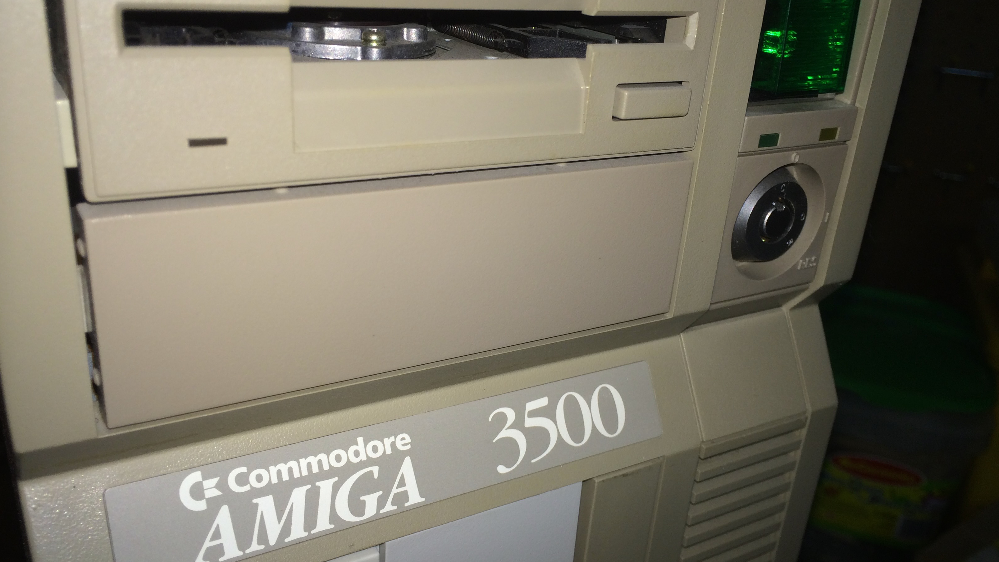
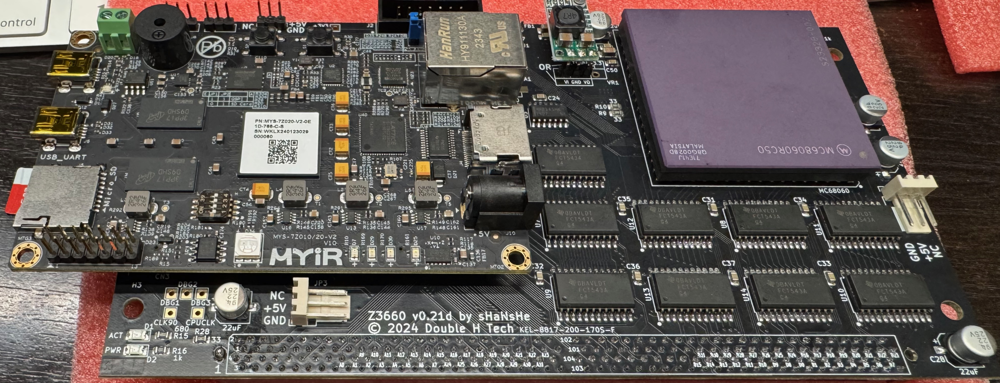

> stew·ard·ship
> /ˈsto͞oərdˌSHip/
> The job of supervising or taking care of something, such as an organization or property. "responsible stewardship of our public lands"

I've had an oscilloscope sitting in my Amazon cart since I started troubleshooting my ailing Amiga 3000. I don't have money for an oscilloscope. At first it was speculative, "hey, I bet I can fix this without tracing out timers." Now it's further and further looking like it's a timing problem.

Retro computing is not a normal consumer field. There is no such thing as an Amiga other than computers made 30-40 years ago now. Normal rules of economics go out the window. The worth of the device is highly elastic. While there are so few functional machines around and no way to buy a new one, scarcity ecnomics doesn't necessarily prevail.

> You don't just own a piece of retro computer hardware. You're its steward. You have a piece of history, whether that history intertwines with your past or not. You can care for it, or neglect it.

I was given stewardship of what would become my Amiga 3500 in the lab at Commodore Canada, and I did neglect it a bit in the early years. I kept it running in the lab, but it was always fast gutted to keep a more valuable retail machine running in the moment. As a prototype, it could not be sold, had no commercial value, and in 1994 it was slated to be destroyed as Deloitte and Touche were liquidating Commodore's assets. I had a quick conversation with Rainer Scharnke (the Controller at Commodore Canada at the time) and it quietly went home with me.

My Amiga 3000 I bought last year from a fellow enthusiast, who bought it from another enthusiast who had been using it for video work, and I don't know its history before that. This was the sleek and streamlined successor of the Amiga 2000, powerful in its day, the most Amiga of the Amigas in my mind before Commodore started stripping the design down for cost reduction and removing sophisticated technologies like SCSI.

> The Amiga's SCSI integration went far beyond the "port on the back of the computer." It was deeply rooted in the architecture of the machine, to the point where the custom chipset could offload from the CPU basic tasks like moving data from the drives to memory. Subsequent Amigas like the 4000 moved to an IDE interface, and data had to be hand-brokered by the CPU - so performance suffered in a multitasking environment. Yes it still irks me!

Because of my personal history with my Amiga 3500, its economics is especially skewed in my mind - it's like a beloved pet. Over the years I've moved it between 6 homes. Every move, I purged other gear, but kept it. In its earlier years it was there to keep other Amiga equipment running, and then it became the centrepiece.

I've been pretty much its only steward.

> I bought this Amiga 3000 I'm repairing to support better stewardship of my Amiga 3500.

I'm reminded of the robots in the Star Wars universe. I think C-3P0 was assembled from parts by Anakin Skywalker in The Phantom Menace, like he'd seen Watto do at the junkyard all his life on Tatooine. How old were those parts? C-3P0 appeared in all the Star Wars movies, probably a 60-70 year old droid, assembled from parts that were even older, by the timeline of Rise of Skywalker.

With today's relative performance of embedded computing technology, my Amiga Z3660 accelerator card emulates the hardware signalling of an old Motorolla 68040 CPU and a whole CPU expansion card, pin for pin, using a little ARM based prototyper board and a Software Defined Logic Chip (SDLC). For fun, it can even delegate the work to a real 68060 CPU, simulating all the circuitry around that too. The PiStorm replaces the 68000 CPU in the Amiga 500 with a Raspberry Pi board and an SDLC. Everything in the Amiga is authentic running on 35 year old chips, except for the guts of your CPU chip, which are emulated in software at a hundred times its original speed on this tiny little modern ARM processor.

Was the C-3P0 that Anakin assembled like a 36 year old Amiga 500 with a PiStorm for a CPU?

> Han Solo and Chewbacca had to re-assemble C-3P0. Luke Skywalker maintained R2-D2. Rey maintained BB-8. Ahsoka maintained R7-A7. I think there's a bit of a parallel between droids in the Star Wars universe, and the computers that the people who participate in the Retro Computing community continue to steward.

So here I sit. Checking off the simple diagnostic tests one by one, inching closer to running out and having to lean into the complicated ones. The economics of spending $1,000 on a piece of electronics repair equipment burning a hole in my Amazon cart, as I work another weekend on not needing it.

If you have an old piece of computing history, you should know that it's worth something in this community. Sometimes that translates into dollars, sometimes it just translates into someone keeping their friend C-3P0 running. If you don't know what else to do, connect with me, reclaim the space in your home and know it'll get some attention.

Or better yet, come hang out with us at the [World of Retro Computing](https://worldofretrocomputing.com/) in Kitchener, Ontario on September 14th and 15th this year! Maybe you'll rekindle something, or maybe you'll find a new home for old neglected computers.