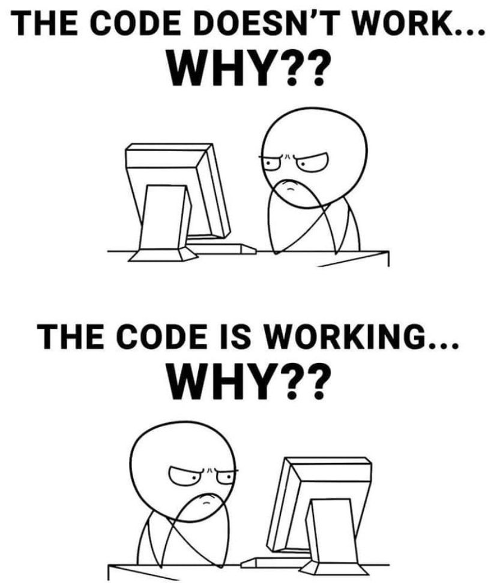
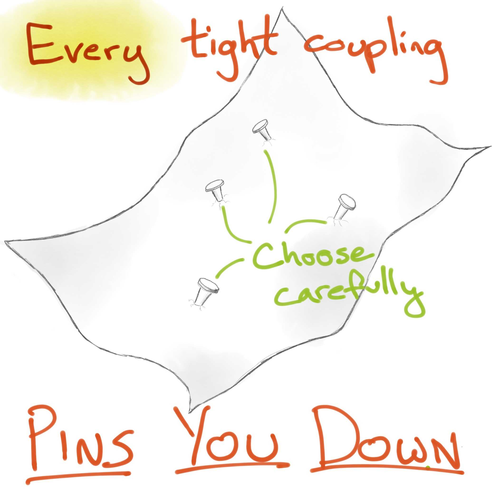
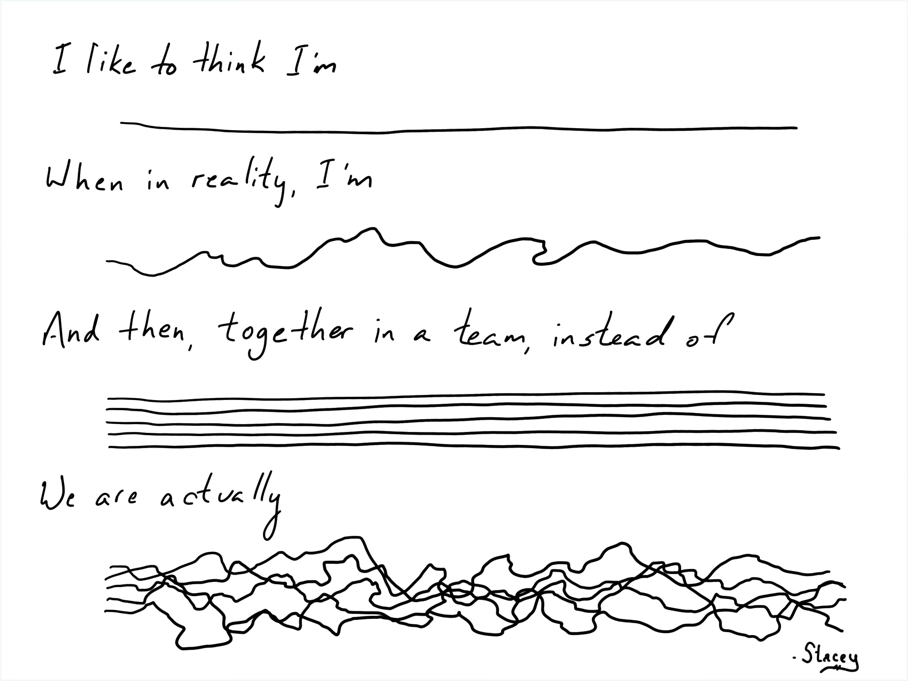

---
tags:
  - agile
  - coaching
  - developer
  - coding
imageAlt: A mesh rendering of a woman at a computer, on an abstract cyberpunk-style line background
image: images/tdd-design-perspective.png
published: true
date: 2025-02-13
title: The Bionic Developer
---
Thanks to a colleague, I came across this article today, and it's been energizing. The author and his editors at O'Reilly have put together a tremendously thoughtful piece that examines this emergent field from a number of perspectives.

https://www.oreilly.com/radar/preparing-for-ai-2/

In reading it, I've extracted a few ideas, and wanted to comment on them, drawing in some other corners of the field of software development that have framed my understanding over the years.

This post is link-rich, to help you understand why I hold the beliefs I have, without you needing to have travelled alongside me over the past few decades. It's also the first of two posts.

Let's first explore 3 core themes: People, Coding, Testing and Design. Yeah, OK, that sounds like 4. This is a blog post. My blog posts especially are never finished, they're merely abandoned.

In my next post, we'll explore some illustrative examples of these ideas, with code, and more stories. I'm going to need a day or three to put that together.

## People

Consider this:

> I—and an increasing number of others—have argued that AI broadens the gap between junior and senior developers.

I've seen this many times now, and it always brings to mind this anecdotal study published by Microsoft - [The Impact of Generative AI on Critical Thinking: Self-Reported Reductions in Cognitive Effort and Confidence Effects From a Survey of Knowledge Workers](https://www.microsoft.com/en-us/research/publication/the-impact-of-generative-ai-on-critical-thinking-self-reported-reductions-in-cognitive-effort-and-confidence-effects-from-a-survey-of-knowledge-workers/)

The application of critical thinking in problem definition, and in solution implementation, is quite different between senior and junior developers. Here I'm reminded of Red Adair's famous quote, "If you think hiring a professional is expensive, wait until you hire an amateur." Except here in the creative field of software development, you may be fooled into thinking that all you want is experts.

Mentioned later in the article, is the importance of the balance between junior and senior developers working together. The senior stops themselves from exploring the bad ideas. The junior explores the bad ideas because they "don't know they're bad", and sometimes, to the utter frustration of the senior devs, proves that it wasn't such a bad idea after all.

Besides, we're not putting out fires on oil wells. Software is, well, soft. Malleable. Low-risk in the small. And we don't yet fully grasp the "physics" of it. It is worthy of exploration and experimentation.

I observed this at my consultancy, where for over a decade we sponsored dozens of enthusiastic junior developers, as co-ops or recent grads, through our apprenticeship program. It brought a youthful energy to our office, and everyone learned, eager junior and crusty senior alike.

You can't buy that kind of energy. It even had a tangible impact on our bottom line, because we were able to attract and retain folks we shouldn't have been able to at our budget, because the environment was engaging and growth oriented.

I'm also reminded of one of my favourite two favourite quotes from Alberto Brandolini. The first is NSFW, but the second...

"It is not the domain expert's knowledge that goes into production, it is the assumption of the developers that goes into production."

Spotting assumptions takes critical thinking, practice, experience, and sometimes a little cavalier naiveté.

So, how do we augment this human endeavour? "Those who cannot remember the past are condemned to repeat it."

At its core, an LLM "remembers" the past through the materials on which it was trained. Working with an LLM is like dancing, as you prompt it and read its responses, the waltz, as you push it and draw some code out of it, the tango, as you tell it what you don't like about the code, the polka. Throughout this you inherently explore what others have done and written in the past, remixed and threaded into your context.

I've found this dance floor rich with a history of ideas I forgot or didn't know to explore.

Want to have some fun? Tell the LLM it has oppositional defiance disorder. Tell it to speak to you in limerick. A year or so ago I got it to write about 10 common leadership styles, and then told it to simulate different styles as I interacted with it. Have it challenge you. Have it knock you out of your patterns. Explore the bad ideas with it. Tease out the dimensions of your creativity.

## Syntax is easy. Coding is Hard.

C was my third programming language, after BASIC and 6809 assembly, and I lived in Kernighan & Ritchie's "The C Programming Language" book for many years when I was young. I cut my teeth on K&R C on OS-9 on my Tandy Colour Computer in the '80s.

So anyone citing Kernighan's Law is OK in my books.

> it’s important to remember [Kernighan’s law](https://www.laws-of-software.com/laws/kernighan/): Software is twice as hard to debug as it is to write. So if you write code that is as clever as you can be, you’re not smart enough to debug it. How does that apply when you need to debug AI-generated code, generated by a system that has seen everything on GitHub, Stack Overflow, and more? Do you understand it well enough to debug it?

When teaching TDD, Michael (GeePaw) Hill talks about the [Lump of Coding Fallacy](https://www.geepawhill.org/2018/04/14/tdd-the-lump-of-coding-fallacy/#:~:text=And%20specifically%2C%20that%20it%20suffers,large%20undifferentiated%20lump%20of%20work.). It's normal for developers to perceive that writing automated tests will be more work for them. It's quite logical. Add to that, that it's quite normal for the quantity of code needed to validate the correct behaviour of a system can be up to or even beyond an order of magnitude of the code required to implement a system, in GeePaw's words, "Ain't nobody got time for that!"

But here's the thing, and the point that GeePaw goes on to make. Debugging is overwhelmingly time consuming. Just this week I dumped 1.5 days of my weekend, and two evenings, debugging an insidious behavioural quirk in Swift. I got the majority of what I wanted done for my app within a few hours Saturday morning, and then spent days chasing a bug, log statements, step by step debugging, I used every trick in the book to try and figure out what was wrong in the code. The most trivial of errors, as it turned out, hidden by obscure contextual subtleties in the use of a certain Swift macro. I read the line that contained the bug hundreds of times. `a = b` and yet a never changed to hold the value in b.

My LLM companion (o3-mini) also couldn't see it. Until I found just the right perspective from which to ask it to explore, and eventually it and I put 2+2 together to find the bug. Was I "pair programming" with it? I don't know. I've done an awful lot of [pair programming](https://martinfowler.com/articles/on-pair-programming.html), it didn't feel like pair programming, perhaps because I never switched driver / navigator roles with it, I only played navigator. Could it be the navigator? It's not how people treat it, it's not how Github Copilot is designed. That's unexplored territory.

When you examine how a developer spends their time, only a small portion of it is actually writing code. In [Today was a Good Day: The Daily Life of Software Developers](https://www.microsoft.com/en-us/research/uploads/prod/2019/04/devtime-preprint-TSE19.pdf) several studies are cited where developers spend between 9% and 61% of their day actually coding, and if you look at the studies "coding" can be a little nebulous. Precisely what activity is coding? Typing code? Debugging? Reading code? My rule of thumb has been developers spending about 1/8 of their day writing code.

I will often say, that from far enough away, all a developer does is type code. It's easy, and natural, from enough distance, to reduce a job function to what can be physically observed. Those in the field know how profoundly more there is to it.

Obviously, the TDD community, like GeePaw, advocates the practice of TDD as a means of reducing or eliminating the need for debugging. In the words of Dave Farley, author of [Continuous Delivery](https://www.amazon.ca/Continuous-Delivery-Reliable-Deployment-Automation/dp/0321601912), "TDD is simply the best way I know to write high quality code, quickly." (also check out [Emily Bache](https://emilybache.com/)and [her materials](https://www.youtube.com/watch?v=OhT0_Xg-vZU)).

But TDD can be a difficult and [sometimes obscure](https://blog.cleancoder.com/uncle-bob/2013/05/27/TheTransformationPriorityPremise.html) craft to master without a mentor nearby, and most folks don't have that luxury. There is little body of knowledge upon which to have significantly trained an LLM. Though formalizations like the Transformation Priority Premise can be succinctly expressed, I'm yet to be successful at using it in an LLM prompt for guidance. Yet.

Can you get by with well-designed (eg testable) code, with tests written afterwards? Sure, many developers do. And this can work, well designed tests prove out the behaviour of code so that you don't have to witness it in the debugger.

To reduce our field to just debugging AI written code would be a travesty. The experience of coding has been described as long periods of frustration punctuated by short bursts of euphoria. Why should we give up the euphoria?

## Testing and Design

I'm a long time fan of Christopher Alexander's [Notes on the Synthesis of Form](https://en.wikipedia.org/wiki/Notes_on_the_Synthesis_of_Form). It didn't help that when I discovered it I was a reclusive teen, desperately avoiding having to confront social situations, further [complicated by my gender dysphoria](https://emergillian.blogspot.com/2012/03/my-herstory.html). It remains the most impactful paper I've read, perhaps alongside [Simulacra and Simulation](https://en.wikipedia.org/wiki/Simulacra_and_Simulation). Yeah, I know, I'm weird. Let's be weird together for a minute, though.

Design is central to both coding and testing. And, I believe that testing requires a good deal more of it than coding. You see, I think of coding as mostly action towards implementation of something known. Sometimes it's exploratory, working to emerge a newly forming idea, but most often we leap to a possible solution and tuck into it.

One of my favourite quotes from Edsgar Dijkstra is “Program testing can be used to show the presence of bugs, but never to show their absence!" Testing is a creative exploration of the unknown.

We explore the unknown, to come to know something, and then once we know it, we can code it.

I very much like Michael Bolton and James Shore's distinction between [Testing and Checking](https://www.satisfice.com/blog/archives/856). It illustrates this well. We check whether what we know is still true - do our automated checks still pass. We test to learn what we need to know. And, because we can only automate what we know, our automated "tests" aren't testing, they're just checking what we already know must be true. And thus testing is an [inherently creative, human activity](https://www.youtube.com/watch?v=KePxuKpwqoI).

"Yes, but what about property-based testing, mutation testing, ...." yes, yes, I know, don't cloud the issue with facts. This is actually why there have been so many updates to Lisa Crispin's [Agile Testing Quadrants](https://lisacrispin.com/2024/10/11/the-agile-testing-quadrants/) over the years. There are some modern automated exploratory testing techniques that we can leverage as developers. But, they're driven by randomness, which is not the same as creativity.

Sometimes folks really latch on to legacy ideas of testing, formalizing "integration testing" or "regression testing" - in the lean agile space we've long dismantled this thinking because the barriers inherent in that thinking slowed down our path to production, with little to no impact on quality. W Edwards Deming: "You can't inspect quality into a product."

And so, when I read a statement like this:

> A good next step is asking an AI assistant to generate unit tests, either for existing code or some new code (which leads to test-driven development).

I'm immediately skeptical. And, so far, trying it hasn't changed my mind.

Again, from far enough away, all testing is is writing validations for the behaviour of your code. The tricky part, is how to write those validations. Specifically, across what points in your code should you validate that behaviour.

Code is full of boundaries. Good code is defined by good boundaries. Good "tests" are defined by the good boundaries that they choose to use for their validation. See that dependency? Good tests require good code.

When you write tests after the fact, you are beholden to the boundaries you created in the code in the absence of tests. This is one challenge, but you can refactor your way out of it.

What's more insidious, however, is that you are likely to form your tests around your implementation, because it is real and concrete and sitting right in front of you, waiting to be validated.

This is a trap. I'm reminded of an old talk from Justin Searls, [How to Stop Hating Your Test Suite](https://www.youtube.com/watch?v=VD51AkG8EZw). You see, when your tests are coupled to your implementation, you can't change your implementation, eg make it better, without breaking your tests. Your days are filled with making some small implementation change, and then wading through the ripple of broken tests to make them adapt to the new behaviour.

One of my favourite coaching moments was when I was working with a brilliant architect at a client in Indianapolis, trying to find a good way to express the value of TDD. He blurted out, "Oh, of course, you can't accidentally test the implementation if there isn't one written yet."

Every one of your tests pin down the boundary across which it runs, making it inflexible.

OK, one last pro tip. You never get the boundaries right. Software is soft, right? Malleable? Yeah, you're going to have to shift them.

Anothing thing I'm always telling people is "don't treat your IDE like a text editor!" Maybe you use an actual text editor, in which case, carry on. But, if you're using an engineering tool like one of the Jetbrains IDEs, use it like an engineering tool. Learn how it helps you refactor. Learn refactoring steps, refactoring to patterns. Technical debt is the difference between the shape of the problem you're solving, and the shape of the code you wrote to solve it. Learn to reshape relentlessly.

And, I think there's an LLM parallel here too. Simple prompting is like treating the LLM like a text editor. Sure, it'll be helpful, but we can do better.

My current exploration in this direction is actually parallel to meta-programming. I think LLM prompting is a form of meta-programming. One of my favourite books on meta-programming is Metaprogramming Ruby by Jose Valim, who went on to create the Elixir programming language on top of the Erlang VM. It's a good introduction using a great programming language, IMO the best since Smalltalk. There are tools like the OpenRewrite framework from Moderne which are designed to perform precise refactors across a code-base, not by asking an LLM to re-generate it, but through precise and deterministic manipulation.

So what happens when you ask an LLM to write some OpenRewrite meta-refactoring code to evolve a code-base? Interesting things, but there's more to explore there than I've had time to. Because I got distracted with abstraction.

One of the places that's frustratingly not as helpful as we hoped it would be is RAG, where we confetti-shred a body of knowledge and feed the LLM a bunch of disparate but related confetti in order to provide a richer answer than its context window allows. Microsoft's GraphRAG paper significantly improves the idea and pointed me back at a bunch of analysis work I've done on larger code-bases to understand them at higher orders. What's the equivalent of an LLM summarizing a paper or meeting notes? Well I think about ideas like [Simon Brown's C4](https://c4model.com/), or Adam Tornhill's work first expressed in [Your Code as a Crime Scene](https://www.amazon.ca/Your-Code-Crime-Scene-Bottlenecks/dp/1680500384).

There is so much to explore.
## Next Up

So now you have the themes, the lenses through which I intend to explore some examples, and a little background info. 

And finally, remember:

Code tends towards chaos, because we tend towards chaos. Entropy creeps in.

You're writing code to solve a shifting problem, for an evolving organization, in a shifting team, in a language that's a work-in-progress, using frameworks that are a work-in-progress, in an editor that's a work-in-progress, on an operating system that's a work-in-progress, on a computer you're likely to have replaced in a couple years.

You are a leaf in the wind.

And we've got a brand new friend to play with.

See you in part 2...