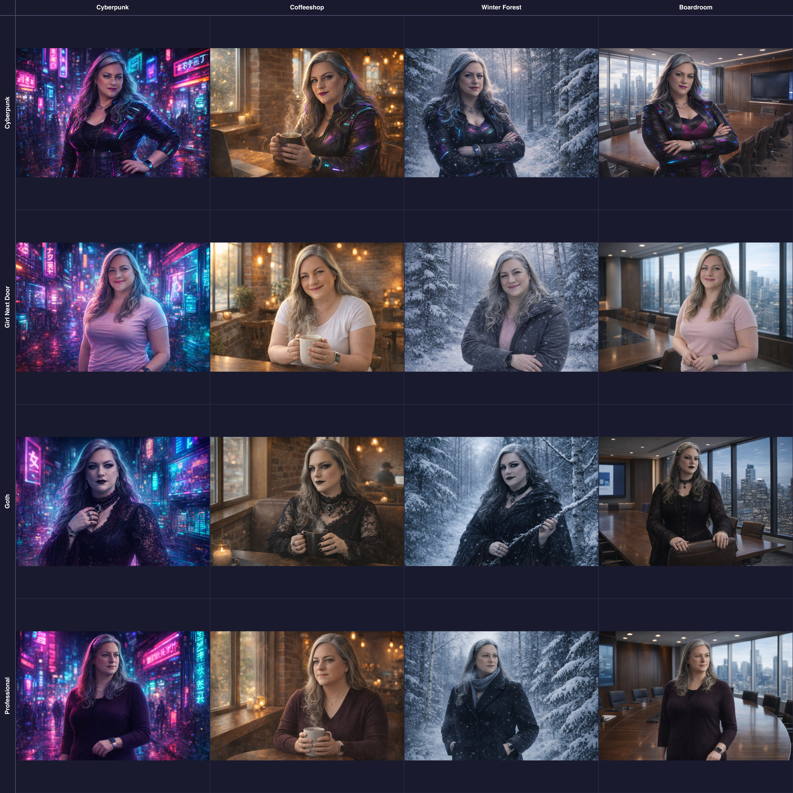

I've been generating images for this blog using AI for a while now, but I kept running into the same problem: consistency. Each image felt like starting from scratch. The character looked different every time. The style drifted. The mood was hit-or-miss.

So I built a system. And it's been working well enough that I thought I'd share the approach.

The core idea is simple: treat image generation like any other structured data problem. Define a schema. Create reusable components. Write tooling to compose them. The result is a framework that produces consistent imagery while still allowing creative flexibility for each piece.



This grid shows what I mean. Same underlying character, systematically varied across four style variants and four scene variants. Sixteen images, all consistent, all generated from composable JSON specifications. The character is recognizable in every frame. The scenes are distinct. And I can generate any new combination just by mixing components.

Here's how it works.

## The Problem with Freeform Prompts

When you're generating images ad-hoc, you end up writing prompts like this:

```
A silver-haired woman in a cyberpunk office, looking frustrated, 
neon lighting, high detail, digital art style
```

This works. Sometimes. But you're encoding a lot of implicit decisions in that one string, and those decisions are easy to forget or contradict in your next prompt. What shade of silver? What kind of cyberpunk aesthetic? What does "frustrated" look like on this character's face?

The next time you generate an image, you'll write something slightly different. The character will look different. The style will shift. Your blog starts looking like a collage of unrelated stock photos rather than a coherent visual identity.

## Structured Scene Specifications

The solution is to externalize those decisions into structured data. Instead of a freeform prompt, I use a JSON specification that describes the scene in detail.

Here's a simplified example:

```json
{
  "ImageType": "banner",
  
  "Character": {
    "Description": "A confident middle-aged woman with a cyberpunk edge",
    "Age": "Middle-aged, confident, formidable",
    "Hair": {
      "Color": "Silver-grey with subtle neon reflections",
      "Length": "Long",
      "Style": "Loose waves, dramatic movement"
    },
    "Face": {
      "Eyes": "Blue-grey, intense, sharp focus",
      "Expression": "Frustrated exasperation",
      "Makeup": "High-contrast; sharp eyeliner, bold magenta lips"
    }
  },
  
  "Style": {
    "Genre": "Cyberpunk / Tech Noir",
    "Lighting": {
      "Type": "Dramatic, high-contrast, cinematic",
      "Sources": ["Neon signs", "Screen glow", "Rim lighting"]
    },
    "ColorPalette": {
      "Primary": ["Magenta", "Cyan", "Electric Blue"],
      "Treatment": "High saturation, strong contrast"
    }
  },
  
  "Situation": {
    "Setting": "Corporate corridor with holographic approval gates",
    "CharacterPose": {
      "Expression": "Exasperated frustration",
      "BodyPosition": "Leaning against a barrier",
      "Gesture": "Hands pressed against holographic gate"
    }
  }
}
```

This is verbose. That's the point. Every decision is explicit. When I generate the next image, I can reuse the Character and Style sections while varying only the Situation. The character looks the same. The aesthetic stays consistent. Only the scene changes.

## The Schema

To keep these specifications consistent, I defined a JSON schema. The schema ensures that every scene file has the required sections and that the structure is predictable.

Here are the key sections:

**ImageType** determines the aspect ratio and purpose:

- `banner` (16:9) - Hero images at the top of articles
- `callout` (1:1) - Inline illustrations
- `diagram` (9:16) - Tall infographics

**Character** describes the recurring character's physical traits, broken into subsections for Build, Face, Hair, and Wardrobe. This is where consistency lives. By keeping this section stable across images, the character remains recognizable.

**Style** defines the visual aesthetic: genre, rendering quality, lighting, color palette, and atmospheric effects. This is what gives your imagery a cohesive feel.

**Situation** is where the per-image creativity happens. It describes the specific scene: setting, camera angle, character pose, and props. Props are categorized by source:

- Character props (wardrobe items, personal effects)
- Article props (objects from the content with symbolic meaning)
- Environment props (setting elements)

**ArticleContext** captures metadata about the article the image accompanies: title, tags, themes, and overall mood. This helps inform the generation without being directly rendered.

## Variants for Flexibility

Once I had the core schema working, I extracted reusable variants. The character and style sections don't need to live in every scene file — they can be pulled from shared definitions.

So to put this into a bit of fun practice, I created two variant types:

**Character variants** define different looks for the same underlying character:

```
character-variants/
├── cyberpunk.json      # Bold makeup, leather jacket, neon accents
├── professional.json   # Clean makeup, tailored blazer
├── goth.json          # Dark romantic, Victorian lace
└── girl-next-door.json # Natural makeup, soft sweater
```

**Scene variants** define different visual styles:

```
scene-variants/
├── cyberpunk.json      # Neon, high contrast, tech noir
├── coffeeshop.json     # Warm, cozy, natural light
├── winter-forest.json  # Cold, ethereal, snow
└── boardroom.json      # Corporate, clean, professional
```

When generating a new image, I can compose any character variant with any scene variant. The cyberpunk character in a coffeeshop. The professional character in a winter forest. The combinations are mix-and-match.

This turned out to be useful for testing. I generated a 4x4 grid of all character/scene combinations to see which pairings worked best. That kind of systematic exploration would be tedious with freeform prompts.

## The Generation Script

The actual image generation uses OpenAI's image API. The script reads a scene JSON file, composes a prompt from the structured data, and calls the API with character reference images.

Here's the core flow:

```javascript
import OpenAI from 'openai';
import fs from 'fs';

const openai = new OpenAI();

async function generateImage(sceneSpec, outputPath) {
  // Load character reference images
  const referenceImages = [
    fs.readFileSync('assets/reference1.jpg'),
    fs.readFileSync('assets/reference2.jpg')
  ];
  
  // Convert scene spec to prompt
  const prompt = buildPrompt(sceneSpec);
  
  // Determine dimensions from ImageType
  const size = {
    banner: '1536x1024',
    callout: '1024x1024', 
    diagram: '1024x1536'
  }[sceneSpec.ImageType];
  
  // Call OpenAI with reference images
  const response = await openai.images.edit({
    model: 'gpt-image-1.5',
    image: referenceImages,
    prompt: prompt,
    n: 1,
    size: size
  });
  
  // Save the result
  const imageData = Buffer.from(response.data[0].b64_json, 'base64');
  fs.writeFileSync(outputPath, imageData);
}
```

The `buildPrompt` function is straightforward — it serializes the scene spec to a string with a preamble instructing the model to maintain the character's appearance from the reference images.

```javascript
function buildPrompt(sceneSpec) {
  const preamble = `Use the provided reference image as the character. 
Maintain the character's appearance, face, and build exactly as shown.`;
  
  return preamble + '\n\n' + JSON.stringify(sceneSpec, null, 2);
}
```

Yes, I'm passing the entire JSON structure as the prompt. This works surprisingly well. The model extracts the relevant details and composes them into a coherent image. The structured format actually helps — it's unambiguous about what each element should be.

## Character Reference Images

The secret to consistent character appearance is reference images. OpenAI's image edit API accepts multiple images as input, which it uses to maintain character likeness.

I use 2-3 reference photos that show the character from different angles and with different expressions. The model uses these to anchor the character's face and build, then applies the wardrobe, makeup, and pose from the scene spec.

This is what makes the system work. Without reference images, the character would drift between generations. With them, she's recognizably the same person whether she's in a cyberpunk corridor or a winter forest.

## Claude Code Integration

The final piece is integration with Claude Code. I use the skills feature to make image generation available directly in my coding workflow.

A Claude Code skill is just a directory with a `SKILL.md` file describing what it does and how to use it. When Claude sees a relevant task, it can invoke the skill.

My skill structure looks like this:

```
.claude/skills/blog-image-generator/
├── SKILL.md              # Skill documentation
├── baselines/
│   ├── banner.json       # Template for banner images
│   ├── callout.json      # Template for callout images
│   └── scene.schema.json # The full JSON schema
├── character-variants/
│   └── *.json            # Character definitions
├── scene-variants/
│   └── *.json            # Style definitions
└── scripts/
    └── generate-image.mjs # Generation script
```

The `SKILL.md` file explains the procedure:

1. Read the article to understand themes and mood
2. Choose appropriate character and scene variants
3. Create a scene JSON file with article-specific situation and props
4. Run the generation script
5. Update the article frontmatter with the image path

With this in place, I can ask Claude to "generate a banner image for this article" and it knows how to do it. It reads the article, designs appropriate props and mood, creates the scene specification, and runs the generation. The result is consistent with my visual identity because the system enforces it.

## Benefits of This Approach

After a few weeks of using this system, a few benefits stand out:

**Consistency without rigidity.** The character and style are stable, but every image is unique. I'm not generating the same image over and over — I'm generating variations within a coherent visual language.

**Explicit creative decisions.** When something doesn't work, I can see exactly why. The lighting was wrong. The expression didn't match the mood. The props were too busy. Everything is visible in the spec, so everything is fixable.

**Composable components.** I can experiment systematically. Want to see how the goth character looks in the boardroom scene? Combine those variants and generate. The combinations are trivial once the components exist.

**Reproducibility.** The scene JSON files are checked into version control alongside the articles. If I need to regenerate an image (maybe the API improves, or I want a different crop), the spec is right there. I'm not trying to remember what prompt I used six months ago.

**AI-assisted workflow.** Because the process is structured, I can hand it off to Claude. "Generate an image for this article" becomes a tractable task rather than an open-ended creative challenge.

## Getting Started

If you want to build something similar, here's where I'd start:

**Define your visual identity first.** What's the recurring element? A character? A style? A setting? Get clear on what needs to stay consistent, then build your schema around preserving that.

**Start simple.** My schema has a lot of sections, but I didn't build it all at once. Start with the minimum viable structure — maybe just Style and Situation — and add sections as you need them.

**Use reference images.** If you have a recurring character, reference images are essential. The more angles and expressions you provide, the better the model can maintain consistency.

**Version control your specs.** The scene JSON files are as much a part of your content as the articles themselves. Check them in. You'll thank yourself later when you need to regenerate something.

**Iterate on your schema.** My schema has been through several revisions. Sections get added, renamed, restructured. That's fine. The structure should serve your workflow, not the other way around.

The goal isn't to eliminate creativity — it's to channel it. By externalizing the decisions that should stay stable, you free yourself to focus on the decisions that should vary. Each image becomes an exploration within a defined space rather than an expedition into the unknown.

That's been the payoff for me: more consistent results with less cognitive overhead. The system handles the consistency. I handle the creativity.

So, try it out! Do better than I did! I'll continue to refine my approach and share occasionally, and I'd love if you'd share your own experiences and insights too!
